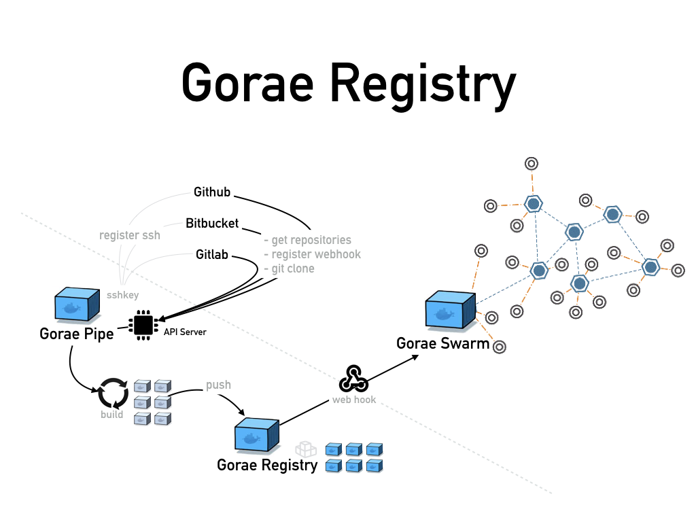

# [](https://github.com/rhiokim/gorae-registry)

The `gorae-registry` project is web interface solution for a private docker registry using modern web technology.

## Usage

(not ready yet)
```
$ docker run \
  -d \
  --restart=always \
  -p 5001:8082 \
```

## Run test

```bash
$ npm test
```

## Dockerize

```bash
$ npm run docker:build  // build image
$ npm run docker:run    // run container
$ npm run docker:rm     // remove running container
$ npm run docker        // run build, rm, run at once
```

### Run docker

```bash
$ docker run -dit -p 8084:8082 \
  -e REGISTRY_HOST=10.0.1.2 \
  -e REGISTRY_PORT=5000 \
  -e GITHUB_SECRET=1234 \
  --name gorae-registry \
  gorae-registry:latest
```

## References
- https://docs.docker.com/registry/spec/api/

## License
MIT
